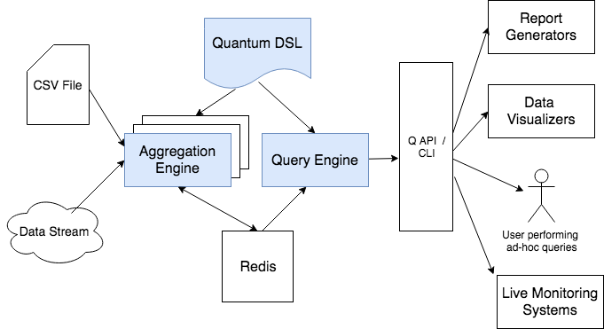

<h1>WELCOME TO QUANTUM</h1>

<h2>An Engine For Fast Time Series Data Aggregation</h2>

Data analytics, whether looking back in time or attempting to predict the future, requires the ability to observe trends in data collected over time.
The tools we use to slice, dice and aggregate time-series data are mainly SQL-based and are too cumbersome to craft or too slow to return the
desired results especially when querying very large data sets.

Quantum was created to address the problems above. It leverages data-streaming and Redis Cache to produce aggregated time-series data that can
be queried in O(1) time complexity. Quantum consists of an aggregation engine and a query language simply called **Q**. 

<h3>Simple Example</h3>

Suppose we have purchase transaction records collected over a time period.
For this example, the records are stored in transactions.csv (in real-world usage, the records would be streamed).

|DateTime|CustomerId|ProductId|Quantity|TotalPrice|
|------- |----------|---------|--------|----------|
|2018-04-11 21:41:33|C1|P1|2|10.00|
|2018-04-11 22:41:33|C2|P1|5|7.00|
|2018-04-12 01:08:04|C6|P2|3|44.00|
|2018-04-12 01:12:12|C3|P2|3|15.00|
|2018-04-12 01:14:11|C2|P2|8|135.00|
|2018-04-12 02:00:22|C3|P4|3|23.00|
|2018-04-12 03:12:17|C1|P7|3|45.00|
|2018-04-12 05:06:09|C7|P1|3|88.00|
|2018-04-12 11:02:14|C5|P6|3|19.00|
|2018-04-12 14:07:16|C5|P5|3|11.00|
|2018-04-13 02:03:02|C4|P2|3|12.00|
|2018-04-14 05:33:23|C7|P2|6|14.00|
|2018-04-15 07:25:55|C1|P2|8|13.00|

Quantum allows you to ask questions like:

* How much dollar volume did product, P1 produce in the last n months, n days, n hours, n minutes?
* What was the total quantity purchased for product, P1 on 2018-04-11 bewteen 21:00 and 23:00?
* How was sales of product P2 on 2018-04-12 and 3 days preceding and succeeding that?

We will first define Quantum's DDL stored in a file 'myagg.yml' to process our data set as shown below:
```
   myagg:
      data_source:
         type: csv
         path: transactions.csv
      data_type: transaction
      dimensions:
         - ProductId
      time:
         - year
         - month
         - day
         - hour
         - min
      measures:
         - Quantity
         - TotalPrice
      datetime_field_name: DateTime
      datetime_field_format: YYYY-mm-dd HH:MM:SS
```

Explanation of the fields:

* **data_source** - specifies where the data records will come from. In the example, it's a csv file called 'transactions.csv'. Quantum supports other sources such as AWS SQS (Kinesis, Kafka, RabbitMQ to come soon)
* **data_type** - the type of our record and we've called it, 'transaction'.
* **dimensions** - the non-time dimensions in our record that we want to aggregate, in this case ProductId
* **time** - the time dimensions which we want to aggregate (Quantum supports year, month, week, day, day_of_week, hour, min, sec)
* **measures** - the numeric columns which we want to aggregate over (Quantum supports sum and average)
* **datetime_field_name** - the name of the date/time field in the data set
* **datetime_field_format** - the format of the date/time field

We then run quantum like so:

    quantum myagg.yml

Aggregated data is now available in Quantum's cache. We can now query it. Start Q to query our data like so:

    q myagg.yml

You may type in your query after the Q: prompt on the command line.  
For example, to ask the question, *How did sales for product P1 do on April 12, 2018?*, Q statement is:

    get ProductId=P1;y=2018;m=4;d=12;

Q commands start with the keyword **get** followed by one or more key/value pairs (separated by semicolon).
The above would return the following data:

```
[
    {
        "key": "/qtname:myagg/dt:transaction/ProductId:P1/y:2018/m:04/d:12",
        "value": {
            "sum_Quantity": 3.0,
            "avg_Quantity": 3.0,
            "sum_TotalPrice": 88.0,
            "avg_TotalPrice": 88.0,
            "count": 1
        }
    }
]
```
Note that the returned data is a key/value pair. The structure of the key reflects the corresponding dimensions defined in the DDL, mygg.yml
The value contains the count, and sum and average values for the measures defined in myagg.yml, namely Quantity and TotalPrice.

Q also supports searching for data backwards/forwards from a reference point in time. For example,
*How did sales for P1 do in April 12, 2018 and its preceding 3 days?*. The Q statement is:

    get ProductId=P1;y=2018;m=4;d=12; 3-

Note that we simply add '3-' to the end of the get statement. Q deduces from the query that '3-' means to look back 3 days.
The above Q statement would return the following:
```
[
    {
        "key": "/qtname:myagg/dt:transaction/ProductId:P1/y:2018/m:04/d:11",
        "value": {
            "sum_Quantity": 7.0,
            "avg_Quantity": 3.5,
            "sum_TotalPrice": 17.0,
            "avg_TotalPrice": 8.5,
            "count": 2
        }
    },
    {
        "key": "/qtname:myagg/dt:transaction/ProductId:P1/y:2018/m:04/d:12",
        "value": {
            "sum_Quantity": 3.0,
            "avg_Quantity": 3.0,
            "sum_TotalPrice": 88.0,
            "avg_TotalPrice": 88.0,
            "count": 1
        }
    }
]
```

You can also search forwards from a reference point in time. 
*How did sales for P2 do in April 12, 2018 and its succeeding 3 days?* The Q statement is:

    get ProductId=P2;y=2018;m=4;d=12; 3+

The result would be:
```
[
    {
        "key": "/qtname:myagg/dt:transaction/ProductId:P2/y:2018/m:04/d:12",
        "value": {
            "sum_Quantity": 14.0,
            "avg_Quantity": 4.666666666666667,
            "sum_TotalPrice": 194.0,
            "avg_TotalPrice": 64.66666666666667,
            "count": 3
        }
    },
    {
        "key": "/qtname:myagg/dt:transaction/ProductId:P2/y:2018/m:04/d:13",
        "value": {
            "sum_Quantity": 6.0,
            "avg_Quantity": 3.0,
            "sum_TotalPrice": 22.0,
            "avg_TotalPrice": 11.0,
            "count": 2
        }
    },
    {
        "key": "/qtname:myagg/dt:transaction/ProductId:P2/y:2018/m:04/d:14",
        "value": {
            "sum_Quantity": 6.0,
            "avg_Quantity": 6.0,
            "sum_TotalPrice": 14.0,
            "avg_TotalPrice": 14.0,
            "count": 1
        }
    },
    {
        "key": "/qtname:myagg/dt:transaction/ProductId:P2/y:2018/m:04/d:15",
        "value": {
            "sum_Quantity": 8.0,
            "avg_Quantity": 8.0,
            "sum_TotalPrice": 13.0,
            "avg_TotalPrice": 13.0,
            "count": 1
        }
    }
]
```

You can combine searching backwards and forwards from a single reference point in time like so:

    get ProductId=P2;y=2018;m=4;d=12; 3-+

You can retrieve records at different levels of of time granularity. For example:

    get ProductId=P2;y=2018;m=4;d=12;h=1
    get ProductId=P2;y=2018;m=4;d=12;h=1;mn=8
    get ProductId=P2;y=2018;m=4;d=12;h=1 4+-
    
<h3>System Architecture</h3>

The following diagram shows the architecture of Quantum. 
    


At the heart of Quantum is its Aggregation Engine. Data is ingested by the engine from a CSV file or read from a data stream. Data aggregation is performed according to the configuration defined in a Quantum DDL file. All aggregated data is stored in Redis and data integrity is ensured by performing all reads and writes atomically. For faster throughput, the data sources can be sharded and multiple aggregation engines run, with each engine processing an independent shard.

The Query Engine translates Q syntax to aggregation keys which are then used to look up values from Redis. Other systems such as Report Generators, Data Visualizers and Alerting systems can be built using the Query Engine API. Users can also query the data using the Q command line interface from a terminal console.


   

